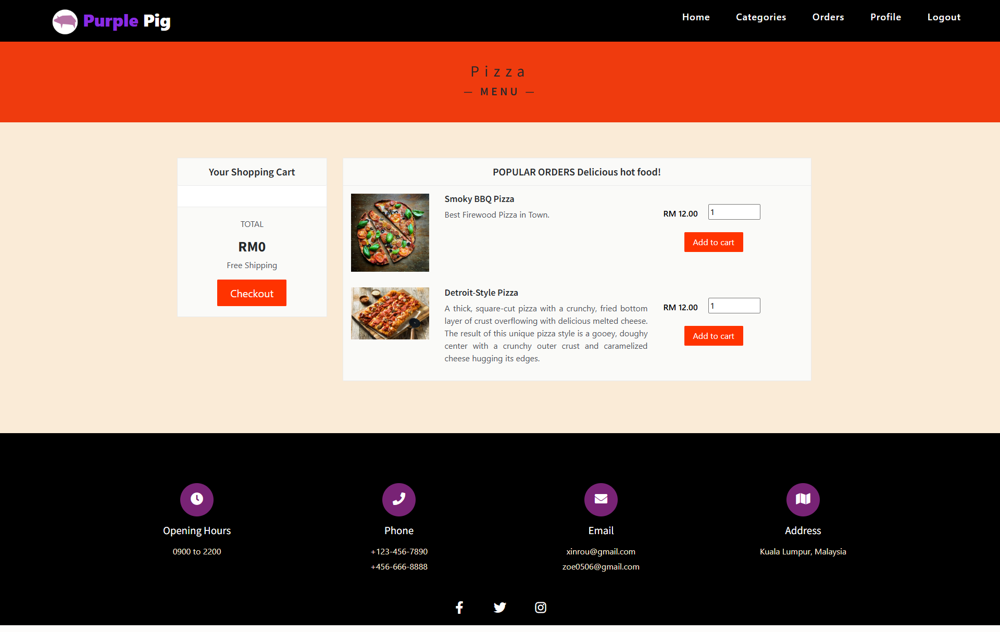

# 🐷 Online Food Ordering System for Purple Pig Restaurant

This is a web-based application developed as a capstone project for the "Purple Pig Restaurant." The system provides a seamless and efficient platform for customers to browse the menu, place orders, and track their delivery status online, moving away from traditional ordering methods. It also includes a comprehensive admin panel for restaurant staff to manage the entire process.

## 📸 Screenshots

| Homepage | Menu Page |
| :---: | :---: |
|  |  |

| Admin Dashboard | Manage Orders |
| :---: | :---: |
|  |  |

---

## ✨ Key Features

The system is divided into two main modules: the Customer Interface and the Admin Panel.

### 👤 Customer Features
- **User Authentication:** Secure user registration and login.
- **Browse Menu:** View food items categorized for easy navigation.
- **Shopping Cart:** Add, remove, and manage items in the cart before checkout.
- **Order Placement:** A straightforward checkout process to confirm contact details and place an order.
- **Order Management:** View current and past orders, check order status (`Dispatch`, `On a way`, `Delivered`).
- **Cancel Order:** Ability to cancel an order before it is dispatched.
- **Receive Order:** Customers can confirm receipt of their food to update the order status to "Delivered".
- **Profile Management:** Users can update their personal information and change their password.

### 🛠️ Admin Panel Features
- **Secure Login:** Separate login portal for administrators.
- **Dashboard:** An overview of key statistics like total orders, customers, food categories, etc.
- **Category Management:** Add or delete food categories (e.g., Pasta, Drinks).
- **Product (Dish) Management:** Add, edit, or delete food items, including details like name, price, description, and image.
- **Order Management:** View all customer orders, update order status, add remarks (e.g., reason for cancellation), and delete orders.
- **User Management:** View a list of all registered customers and administrators.

---

## 💻 Tech Stack

- **Frontend:** HTML, CSS, JavaScript
- **Backend:** PHP
- **Database:** MySQL
- **Server Environment:** Apache (via XAMPP / WAMP)
- **Development Tools:** Adobe Dreamweaver, phpMyAdmin

---

## 🎓 Project Context

This project was created by **Chou Xin Rou** as a final requirement for the **CAP 2108 Capstone Project** during the January 2022 Session.
